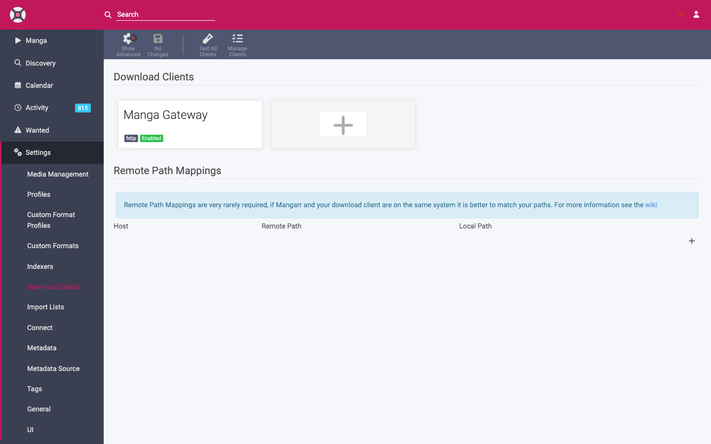

# Download Clients

A **download client** is what Mangarr uses to *grab* a chapter and receive the finished file. Mangarr has one: the **Mangarr Gateway** download client, which tells your **[MangarrGateway](../gateway.md)** to download a release and hand back the completed CBZ.

Find this under **Settings → Download Clients**.

!!! info "Pairs with the Gateway indexer"
    The **[indexer](indexers.md)** searches; the download client grabs. Both must point at the same Gateway with the same API key. Set them up together — see **[Connecting MangarrGateway](../getting-started/gateway-setup.md)**.

## Adding the Gateway download client

1. **Settings → Download Clients → Add (+) → Mangarr Gateway**.
2. Configure:

| Field | Description |
|-------|-------------|
| **Host** | Gateway host only (e.g. `gateway` or `192.0.2.10`) — no `http://`. |
| **Port** | Gateway port (e.g. `9191`). |
| **Use SSL** | Enable only if the Gateway is served over HTTPS. |
| **URL Base** *(advanced)* | Sub-path the Gateway API lives under. Default is `/api`; the effective endpoint is `http://[host]:[port]/[urlBase]`. |
| **API Key** | The Gateway's API key. |

3. **Test**, then **Save**.

## How downloading works

1. Mangarr decides on a release (see **[Searching & Grabbing](../usage/searching.md)**) and sends it to the Gateway download client.
2. The Gateway downloads the chapter from the source and assembles a **CBZ**.
3. Mangarr tracks progress in **Activity → [Queue](../usage/activity.md)**.
4. When the download completes, Mangarr **imports** the finished file into your library, renames it per **[Media Management](media-management.md)**, and records it in **[History](../usage/activity.md)**.

## Completed-download handling

Options that affect import:

- **Remove completed downloads** — clean up finished items from the Gateway/queue after a successful import.
- **Import handling** — Mangarr moves or hardlinks the finished file into your library. Keep the Gateway's download location and your library under a **single common volume** so this is instant rather than a slow copy (see the volume note in **[Installation](../getting-started/installation.md)**).

## Remote path mapping

If the Gateway reports a download path that differs from how Mangarr sees that same location (common when they run in different containers or hosts), use **Remote Path Mapping** to translate the Gateway's path into Mangarr's path. Most single-host Docker setups that share a `/data` mount don't need this.

## Troubleshooting

- **Test fails** — wrong host/port, Gateway down, or SSL mismatch. Don't include `http://` in **Host**.
- **Downloads complete but never import** — usually a path or permissions issue: check Remote Path Mapping and `PUID`/`PGID`/`UMASK`. See **[Troubleshooting](../troubleshooting.md)**.
