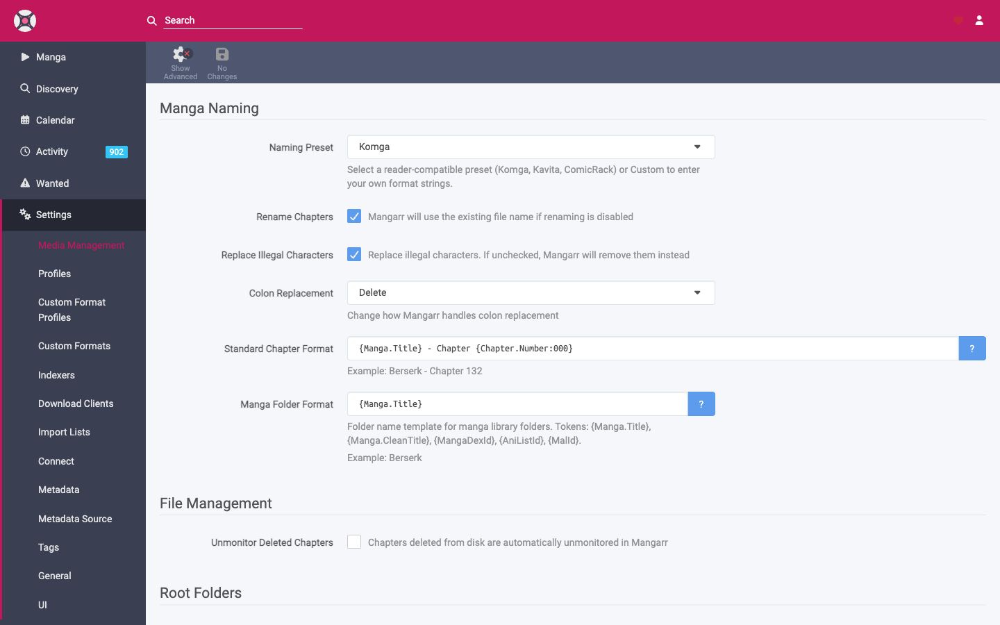

# Media Management

**Settings → Media Management** controls where files live and how Mangarr names, moves, and maintains them.

## Root folders

A **root folder** is a top-level directory that holds a library of manga. Each title you add gets its own subfolder beneath the root.

- Add one with **Add Root Folder** and point it at a path Mangarr can write to (e.g. `/data/manga` in Docker).
- You can have multiple root folders (e.g. one per drive or per content type).
- Mangarr shows free space per root folder and warns if one becomes unavailable.

!!! warning "Paths are from Mangarr's perspective"
    In Docker, use the path **inside the container** (what you mounted at `/data`), not the host path. Mangarr can only see paths that are mounted into it.

## Chapter naming

Mangarr renames imported files to a consistent scheme using **tokens**. Configure the format under **Chapter Naming**.

Typical tokens you can use in the format string:

- Manga title
- Chapter number (with padding)
- Volume number (display only, where available)
- Translation language
- Scanlation group / source
- Original/release title

A preview shows how a sample chapter will be named as you edit. Pick a scheme your reader app handles well (most readers sort cleanly on a zero-padded chapter number).

!!! tip "Renaming existing files"
    Changing the naming scheme doesn't rewrite old files automatically. Use the **Rename** action on a title (or in bulk) to bring existing files in line with the new format.

## Folders

- **Create empty folders** — whether to keep a title's folder even when it has no files.
- **Delete empty folders** — clean up folders left behind after files are removed.

## File management

| Setting | What it does |
|---------|--------------|
| **Use hardlinks instead of copy** | When importing from a download folder on the *same* volume, hardlink instead of copying — instant and space-free. Falls back to copy across volumes. |
| **Import extra files** | Also import companion files (e.g. metadata sidecars) alongside the chapter. |
| **Unmonitor deleted chapters** | If a file disappears from disk, mark that chapter unmonitored instead of immediately re-downloading it. |
| **Recycle Bin** | A path where deleted/replaced files are moved instead of being permanently deleted, so you can recover them. Strongly recommended. |
| **Recycle Bin cleanup** | Automatically purge recycle-bin files older than N days. |

!!! tip "Set a Recycle Bin"
    With no Recycle Bin configured, replaced and deleted files are removed permanently. Setting one gives you a safety net during upgrades and bulk operations.

## Permissions (Linux/Docker)

- **chmod / file permissions** settings let Mangarr set ownership and permission bits on imported files.
- In Docker these are driven mainly by `PUID`, `PGID`, and `UMASK` (see **[Installation](../getting-started/installation.md)**). Make sure they match the owner of your `/data` library, or imports will fail to move files.

## File format

Mangarr stores chapters as **CBZ** archives — a standard, widely supported comic format that virtually every manga reader (Komga, Kavita, Tachiyomi/Mihon, etc.) understands.
