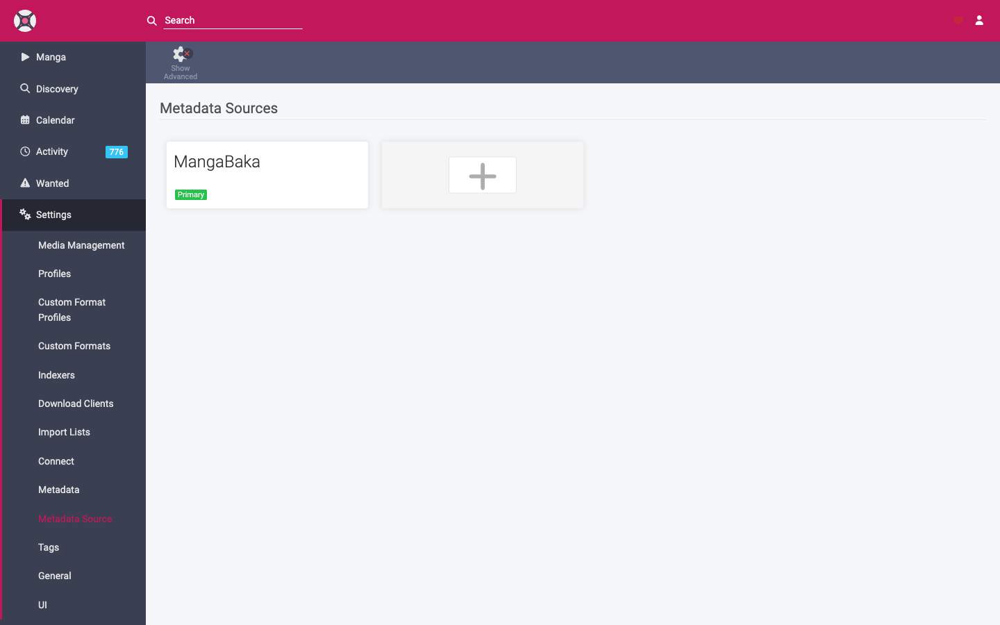

# Metadata

Metadata is the information *about* your manga — title, cover art, description, and the chapter list Mangarr tracks against. Two areas control it.

## Metadata Source

**Settings → Metadata Source** chooses where Mangarr looks up titles when you search to **[add a manga](../usage/adding-manga.md)**, and where it refreshes details from.

Mangarr uses **MangaBaka** as its metadata source. It ships pre-configured as the **Primary** source and supplies the canonical title, cover, synopsis, and the list of chapters Mangarr expects to exist — which is what "missing" is measured against.

!!! warning "Use only MangaBaka"
    MangaBaka is the supported metadata source — leave it as the **Primary** source and don't add or switch to anything else. MangaBaka aggregates IDs across MangaDex, AniList, and MyAnimeList, so it gives the best matching for the rest of Mangarr (including **[Discovery](../discovery.md)** and **[Import Lists](import-lists.md)**). Using a different metadata source is unsupported and can lead to mismatched titles and chapter lists.

(MangaDex, AniList, and MyAnimeList still appear elsewhere in Mangarr — but as **[Import List](import-lists.md)** sources for auto-adding titles, *not* as metadata sources.)

!!! note "Metadata source vs. the Gateway"
    The **metadata source** describes a title and its chapters. The **[Gateway](../gateway.md)** actually finds and downloads those chapters. They're separate: metadata says *what should exist*, the Gateway *fetches it*.

## Metadata (file/sidecar) settings

**Settings → Metadata** controls what Mangarr writes to disk alongside your files, so other apps can read it:

- **Cover images** — save the title's cover into its folder.
- **Sidecar metadata files** — write metadata files some readers/scanners use.

Enable the formats your reader benefits from. Komga and Kavita can read embedded/sidecar metadata, though they also scan covers and titles on their own.

## Refreshing metadata

- Mangarr periodically refreshes title metadata so new chapters in the source are discovered.
- Force a refresh on a single title from its detail page (**Refresh**), or refresh the whole library from the system tasks.
- A refresh updates the chapter list, which can surface newly **missing** chapters for automatic search.

## Leave MangaBaka as Primary

There's nothing to pick here — MangaBaka is configured as the Primary metadata source out of the box and should stay that way. If it ever shows as missing or not marked **Primary**, re-add it and set it Primary so title lookups, refreshes, **[Discovery](../discovery.md)**, and import-list matching keep working correctly.
