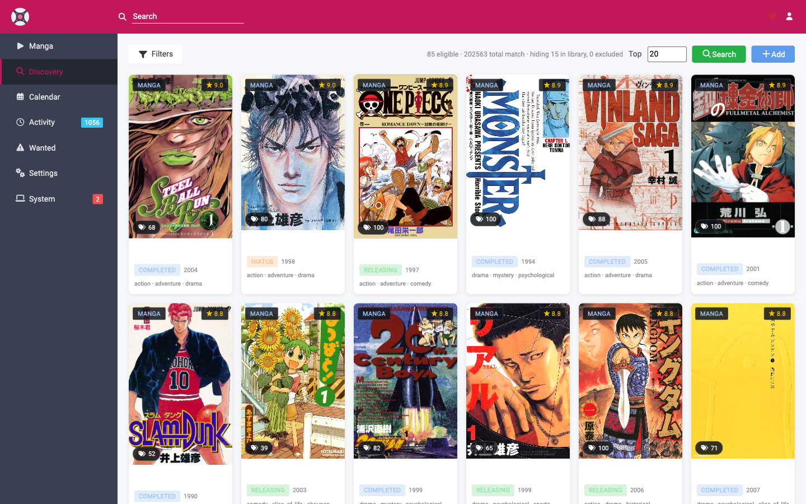
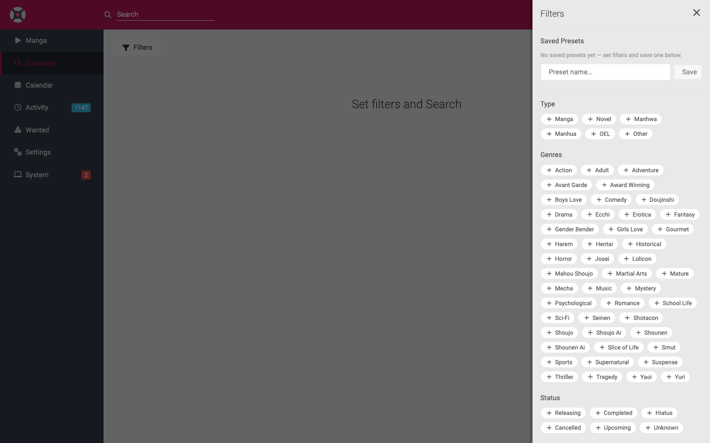

# Discovery

**Discovery** is a Mangarr-original feature: a filtered "browse and bulk-add" page. Set the attributes you're in the mood for, hit **Search**, and Mangarr shows you a poster grid of matching titles you *don't already have* — then add the top N in one click.

It's reachable from the **Discovery** entry in the sidebar (between Manga and Calendar), or at `/discovery`.

!!! info "Discovery browses the MangaBaka catalog"
    Discovery searches the **MangaBaka** attribute catalog to find candidates. It automatically hides titles already in your library, so everything you see is something new to add.

## How it works

1. Open **Discovery**.
2. Click **Filters** and build a query in the drawer (see below).
3. Set **Top** to how many titles you want to add (e.g. 20).
4. Click **Search** — Discovery returns a poster grid of matching titles not already in your library.
5. Either **Add** the top N in bulk, or **exclude** individual titles you don't want first.

!!! note "Search is manual"
    Discovery doesn't auto-search when the page loads — it waits until you press **Search**. You'll see a *"Set filters and Search"* prompt until then.

## The filter drawer

Click **Filters** to open the query builder on the right:

| Filter | What it does |
|--------|--------------|
| **Type** | Manga, Novel, Manhwa, Manhua, OEL, Other. |
| **Genres** | Tri-state chips — click once to **include** (green ✓), again to **exclude** (red ✕), again to clear. |
| **Status** | Releasing, Completed, Hiatus, Cancelled, Upcoming, Unknown. |
| **Content Rating** | Filter by rating; an **Include adult** toggle controls whether adult titles appear at all. |
| **Tags** | Type-ahead tag search with an **AND / OR** mode toggle for combining tags. |
| **Year / Score ranges** | Narrow by publication year and average score. |
| **Sort** | Order the results (e.g. by score). |

Tri-state chips are the key idea: each attribute can be **required**, **forbidden**, or **ignored**, so you can say things like "Action **and** Fantasy, but **not** Harem".

### Saved presets

At the top of the drawer you can **save** the current filter selection under a name and re-apply it later — handy for moods you browse often ("seinen action", "completed romance", etc.).

## Adding titles

- **Bulk add the top N** — set **Top** to a number and click **Add**. A short confirmation modal applies the same defaults as the normal add flow (root folder, monitoring, translation profile, tags, and whether to search on add), then queues all N titles. The add runs in the background; the rows drop from the grid as they're added.
- **Exclude a title** — hover a card and click the **✕** to remove it from the results. This adds a global **[Import List Exclusion](configuration/import-lists.md)**, so it also won't be auto-added by import lists in future. An **Undo** toast lets you reverse an accidental exclude immediately.

The defaults used for bulk-add come from the standard **[Add Manga](usage/adding-manga.md)** options, so set your preferred root folder / monitoring / translation profile there first.

## Pool exhausted

If your filters are narrow, Discovery may run out of eligible (not-already-in-library) titles before reaching your **Top** count. When that happens it shows a **pool-exhausted** banner — loosen the filters or lower the count to see more.

## Tips

- Start broad, then tighten — add an exclude chip or two to carve away what you don't want.
- Use **presets** for combinations you return to.
- Discovery is the fastest way to grow a library quickly; pair it with sensible **[monitoring](usage/adding-manga.md)** defaults so new titles start downloading right away.
