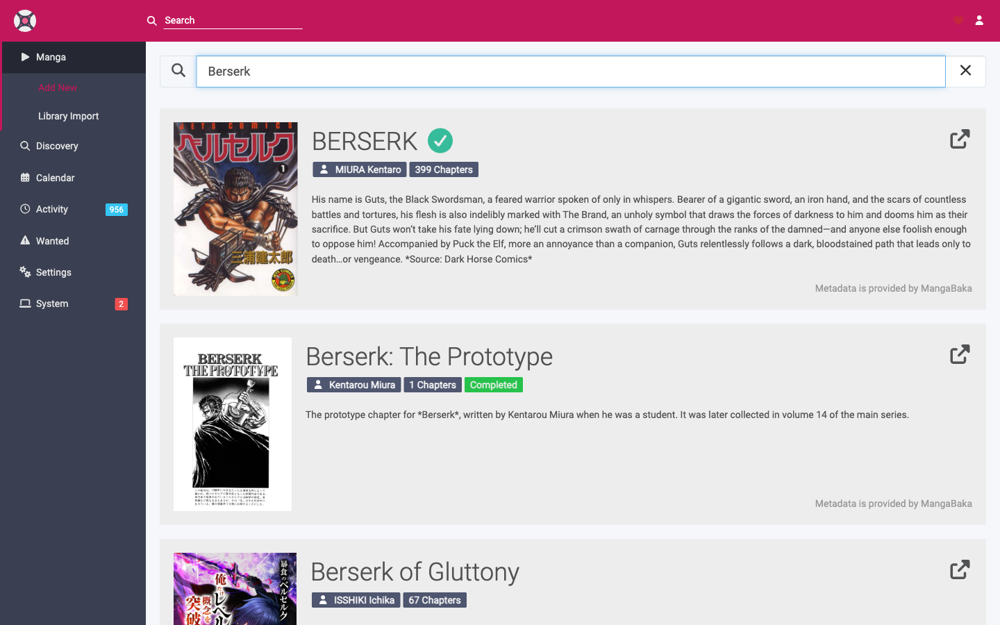

# Adding Manga

Adding a title tells Mangarr to track it, where to store it, which chapters to monitor, and which translation profile to apply.

!!! note "Prerequisites"
    Make sure you've added at least one **[root folder](../configuration/media-management.md)**, created a **[Translation Profile](../configuration/profiles.md)**, and **[connected the Gateway](../getting-started/gateway-setup.md)**.

## Add a single title

1. Go to **Add New** (in the Manga/Library area).
2. Search for the title by name. Results come from your configured **[metadata source](../configuration/metadata.md)** (MangaDex / AniList / MyAnimeList).
3. Click the correct result to open the add dialog.
4. Set the options below.
5. Click **Add**.

### Add options

| Option | Description |
|--------|-------------|
| **Root Folder** | Where this title's folder will be created. |
| **Monitor** | Which chapters to watch (see below). |
| **Translation Profile** | The language preference/upgrade rules to apply. |
| **Tags** | Optional labels used for filtering and for targeting notifications, import lists, etc. |
| **Search on add** | If enabled, Mangarr immediately searches for monitored chapters after adding. |

## Monitoring options

**Monitoring** controls which chapters Mangarr will actively try to download and upgrade. You can change it any time after adding.

| Monitor setting | Behaviour |
|-----------------|-----------|
| **All Chapters** | Monitor every chapter, past and future. |
| **Future Chapters** | Only monitor chapters released from now on. |
| **None** | Add the title but don't monitor anything (you can monitor chapters manually later). |

Only **monitored** chapters are searched automatically and counted as "missing". Unmonitored chapters are ignored by the automatic search — handy for titles where you only care about new releases.

## What happens after adding

1. Mangarr creates the title's folder under the chosen root folder.
2. It fetches metadata (cover, description, chapter list) from your metadata source.
3. If **Search on add** was enabled, it searches the Gateway for monitored chapters and grabs the best matches.
4. New chapters are imported, renamed, and filed as CBZ. Track progress in **[Activity](activity.md)**.

## Bulk / list-based adding

To add many titles at once without searching for each by hand, use **[Import Lists](../configuration/import-lists.md)** — Mangarr can automatically add everything from a MangaDex, AniList, or MyAnimeList list and keep it in sync.

## Editing & removing

- **Edit** a title to change its monitoring, translation profile, root folder, or tags. You can also edit several titles at once with the bulk-edit tools in your library.
- **Delete** a title to remove it from Mangarr. You'll be asked whether to also delete the files on disk — leave that off to keep your downloaded chapters.

Next: see how your **[library](library.md)** displays status, or how **[searching](searching.md)** finds and grabs chapters.
