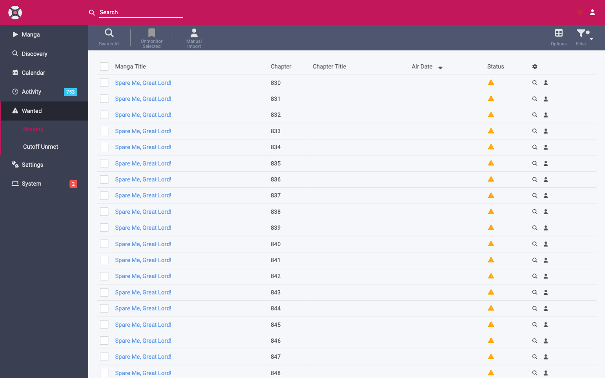

# Wanted: Missing & Cutoff Unmet

The **Wanted** area lists chapters Mangarr still wants to fetch or improve. It has two tabs.

## Missing

**Missing** lists every **monitored** chapter that has no file yet. These are the chapters automatic search is trying to fill.

From here you can:

- **Search All** — kick off an automatic search for every missing chapter.
- **Search** an individual chapter.
- Open an **[interactive search](searching.md)** to pick a specific release.
- Jump to the title or the chapter's detail.

!!! note "Only monitored chapters appear here"
    If a chapter you expected is missing from this list, it's probably **unmonitored**. Monitor it from the title's detail page and it will show up.

## Cutoff Unmet

**Cutoff Unmet** lists chapters that *do* have a file, but haven't reached the **upgrade cutoff** you defined in their **[Translation Profile](../configuration/profiles.md)**. In other words: Mangarr has *something*, but it's still hoping for *something better* (a more-preferred language, or a higher-scoring release per your **[custom formats](../configuration/custom-formats.md)**).

Mangarr will keep trying to upgrade these during scheduled searches. You can also:

- **Search All** to attempt upgrades now.
- **Search** or **interactively search** an individual chapter.

When a chapter reaches its cutoff, it drops off this list and Mangarr stops looking for improvements.

## Tuning what shows up

- **Too many "missing"?** You may be monitoring more than you want. Switch some titles or chapters to *unmonitored*, or change a title's **monitor** setting (see **[Adding Manga](adding-manga.md)**).
- **Chapters stuck on "cutoff unmet"?** The preferred release may simply not exist yet, or your profile's cutoff is set very high. Review the **[profile](../configuration/profiles.md)**.
- **Want fewer upgrades?** Set the cutoff to your minimum acceptable language so chapters are considered "done" sooner.
